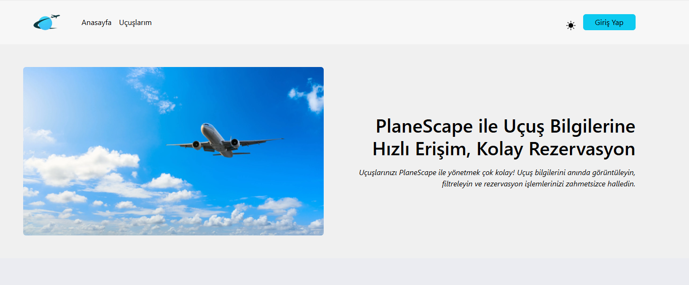
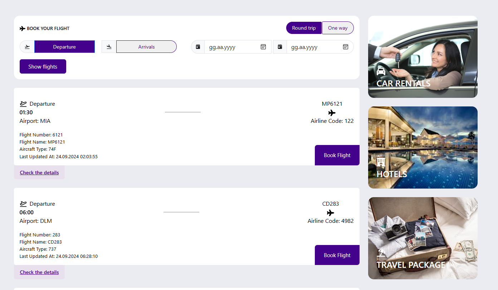
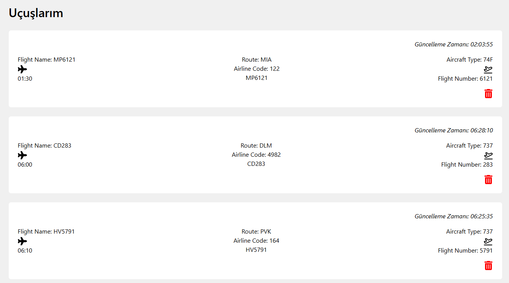
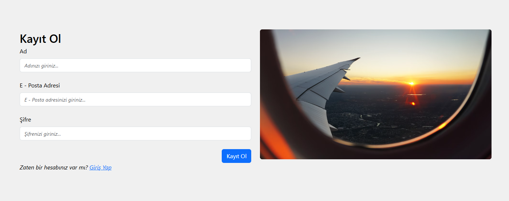
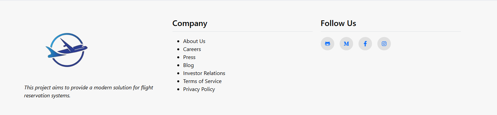

# Plane Scape

---

## Proje Açıklaması
Bu proje, uçuş rezervasyon sistemleri için modern bir çözüm sunmayı amaçlamaktadır. Kullanıcılar, uçuş detaylarını görüntüleyebilir ve giriş yaptıktan sonra rezervasyon yapabilirler. Yapmış oldukları rezervasyonları da görüntüleyebilirler. Uygulama, React, Node.js ve MongoDB gibi modern teknolojiler kullanılarak geliştirilmiştir.

---

## İçindekiler
1. [Gereksinimler](#gereksinimler)
2. [Adımlar](#adımlar)
3. [Kullanım](#kullanım)
4. [Ekran Görüntüleri](#ekran-görüntüleri)

---

## Gereksinimler
Projeyi kurmadan önce aşağıdaki yazılımların sisteminizde kurulu olduğundan emin olun:

- **Node.js**: Node.js uygulama geliştirmek için gereklidir. İndirmek ve kurmak için [Node.js resmi web sitesini](https://nodejs.org/) ziyaret edebilirsiniz.
- **MongoDB**: Proje veritabanı olarak MongoDB kullanır. MongoDB’yi kurmak için [MongoDB'nin resmi web sitesini](https://www.mongodb.com/) ziyaret edin.

---

## Adımlar

1. Depoyu Klonlayın: Proje dosyalarını yerel makinenize klonlayarak başlayın. Terminal veya komut satırı aracılığıyla aşağıdaki komutu çalıştırın:

    ```bash
    git clone https://github.com/ahmetkanbaz/PlaneScape.git
    ```

   Bu işlem, projenin bir kopyasını bilgisayarınıza indirir.

2. Proje Dizinine Geçiş Yapın: Klonlama işlemi tamamlandıktan sonra, projenin yer aldığı dizine geçin:

    ```bash
    cd planescape
    cd backend
    ```

   Yukarıdaki komutları teker teker farklı terminallerde çalıştırın.

3. Bağımlılıkları Yükleyin: Her iki terminal içerisinde de aşağıdaki komutu çalıştırarak gerekli bağımlılıkları yükleyin:

    ```bash
    npm install
    ```

4. Ortam Değişkenlerini Ayarlayın:Projeyi düzgün bir şekilde çalıştırmak için, proje dizininde bir `.env` dosyası oluşturup aşağıdaki ortam değişkenlerini eklemeniz gerekmektedir (backend):

    ```plaintext
    MONGO_URI=mongodb://localhost:27017/planescape
    PORT=3001
    ```

5. Sunucuyu Başlatın: Ardından backend kısmını çalıştırmak için terminalde aşağıdaki komutu kullanın:

    ```bash
    node app.js
    ```

   Diğer terminal üzerinden de frontend kısmında React'i çalıştırmak için aşağıdaki komutu yazın:

    ```bash
    npm start
    ```

---

## Kullanım
1. Tarayıcınızı açın ve `http://localhost:3000` adresine gidin.
2. Anasayfada uçuş listesine göz atabilir, giriş yaparak rezervasyon işlemleri yapabilirsiniz.
3. Giriş yaparak yaptığınız rezervasyonları `Uçuşlarım` bölümünden görüntüleyebilir ve yönetebilirsiniz.

---

## Ekran Görüntüleri
### Anasayfa




### Uçuşlarım Sayfası



### Giriş Yap Sayfası


### Kayıt Ol Sayfası


### Footer Kısmı

